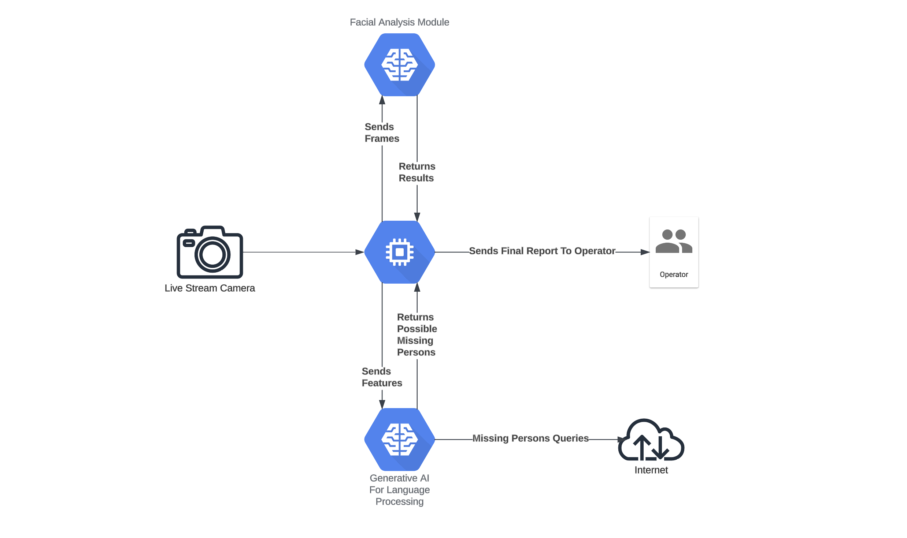
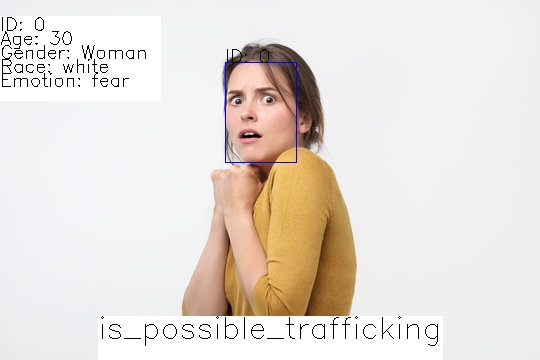
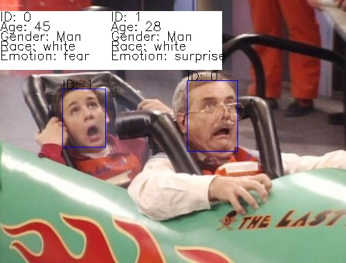
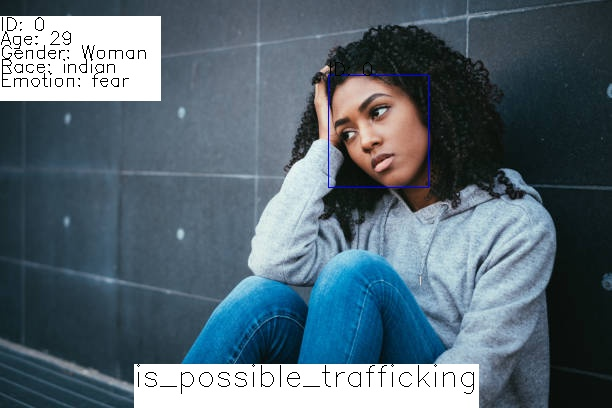

# Can FOSS Computer Vision Combat Human Trafficking - Part I

I am an engineer and I am passionate about a great many things:

- The ocean
- Good food
- Camping / Nature

But, I also have a strong belief that we should try to make the world safer 
for everyone. Unfortunately, I don't feel as though that's the case right
now. Everywhere I turn, there's another case of something heinous happening
so, as an engineer and computer scientist, what can I do? In this post, 
I'd like to see if I can develop something that can detect possible human
trafficking threats using FOSS computer vision libraries. In this quest for justice, 
we will leverage Python and the formidable combination of DeepFace and OpenCV to
perform these analyses. We will then form some initial business logic about
possible threats - what are their demographics/ages/etc.?

This intersection of artificial intelligence, computer vision, and human 
trafficking may seem like an unlikely partnership at first glance, 
but I believe the potential impact is profound. By leveraging cutting-edge technology, 
we can not only identify potential victims but also search missing persons for matching
criteria, alert authorities, and geo-tag images in real time to hopefully bring
us one step closer to eradicating this heinous crime. 

In this blog post, we will explore how open-source computer vision libraries, 
DeepFace and OpenCV, can be used to detect subtle cues such as facial expressions 
and ages that may signify high probability victims. We will show preliminary results
and in subsequent posts, I will expand upon these to add new features such as
LangChain integrations for missing persons queries and GeoJson for geo-tagging.

But, let's get started!

## System Overview
I want to first give an overview of my envisioned system as a whole, which
is subject to change as I develop this software. But anyway, let's
take a look at the below:



In the system design, we can see that we will use a camera as our IoT device. It
will stream frames from itself to our application. Our application will then send
the frames to the facial analysis module which will:

- Find any faces in the frame
- Detect their age, gender, emotion, and race
- Annotate the frame
- Return the frame and the results to the application

The application will then do a set of criteria checks on the results to see if this
is a possible human trafficking case. Our initial attempt at business logic here will
be:

- Children in danger: Are there any faces under 18 years old which are displaying
    fear or disgust?
- Woman in danger: Are there any faces which belong to women which are displaying
    fear or disgust?

These are simple criterias, which will produce false postivies/negatives but it is
a start!

If we find any matching criteria, we will eventually forward them along to a
generative AI module (think LangChain) which will perform a missing persons 
check. If there is a matching missing persons report, we will geo-tag the image
and send our results to an operator. To be clear, today we will just be looking
at a subset of the whole system:

- The facial analysis module
- The beginning portions of the application such as basic criteria checks, reading
    from streams, and passing images onto the facial analysis module

Let us look at the main libraries we will use to build these modules.

## Main Libraries - DeepFace and OpenCV

[DeepFace](https://pypi.org/project/deepface/) is an incredibly lightweight facial 
recognition and analysis library that is openly available to python users. 
It comes prebundled with some of the most popular facial detection libraries such as:

- Retina Face
- VGG-Face
- Google Facenet
- and more.

A full list of detectors and models can be found in their [documentation](https://pypi.org/project/deepface/).
It wraps each model with a standard interface which means we can integrate
this into our code seamlessly and, if desired, change models without any
effort.

With DeepFace, we get access to some amazing features:

1. Face Verification - Comparing two faces to eachother and returning a probability
                        of how similar they are. If the similarity is high enough,
                        the model confidently reports that they are the same face.
2. Face Recognition  - Recognizing a face from a known database of faces
3. Face analysis     - Analyzing a facial image for gender, age, emotion, race,
                       and other properties which can be derived from the face.

[OpenCV](https://opencv.org/) is the open computer vision library. It's an open source
computer vision and machine learning library. It comes prebundled with a slew of
analysis tools such as edge detectors, contour detectors, haar cascaders, and so 
much more.

## Preliminary Results - Static Image Analysis
There is a lot of code, so I think it's best to show the preliminary
results as opposed to the whole code base. If you would like to access
the code, please reach out to me or respond to this article and I will 
happily give you access.

I tested with three images that showed people in some sort of fear. Let's take 
a look at the results below:

```shell
prompt> poetry run python trafficdetection/main.py --images-directory ./trafficdetection/test-images/ --save-results --show-results

2023-11-09 09:42:12.175 | INFO     | utils:analyze_image:81 - Found Possible Criteria Match - is_possible_trafficking
2023-11-09 09:42:12.176 | INFO     | utils:analyze_image:99 - saving to ./trafficdetection/test-images/test3.processed.jpg
2023-11-09 09:42:18.822 | INFO     | utils:analyze_image:99 - saving to ./trafficdetection/test-images/test2.processed.jpg
2023-11-09 09:42:25.056 | INFO     | utils:analyze_image:81 - Found Possible Criteria Match - is_possible_trafficking
2023-11-09 09:42:25.056 | INFO     | utils:analyze_image:99 - saving to ./trafficdetection/test-images/test.processed.jpg
```





Okay, so the results aren't too bad. We see that, if we have a woman
and she is showcasing fear, we mark the image as `is_possible_trafficking`.

In the perfect world, if this mark gets added to an image, that's when we
would alert our generative AI module to start looking for missing persons
who may or may not fit the description (age ranges, genders, and races).

## Preliminary Results - Live Video Stream
Let's do the same thing with a video stream. I will first do one with 
my webcam, processing frames of myself showcasing various facial expressions:

```shell
prompt> poetry run python trafficdetection/main.py --video-device 0 --save-results --show-results
prompt> 
```


We can see that my expressions are captured in real time from my webcam. There
is a slight delay as we buffer frames and then process them on a separate
thread so that we get a smooth output video, but the result is pretty good.
Because I am not a child nor a woman, no trafficking alerts are sent out which
is evident by our logs (above) and the output video.

Let's try it with a video file:

```shell
prompt> poetry run python trafficdetection/main.py --video-file ./trafficdetection/test-videos/evil-dead.mp4 --save-results --show-results

2023-11-09 10:35:52.942 | INFO     | utils:analyze_video:66 - Found Possible Criteria Match - is_possible_trafficking
2023-11-09 10:35:55.008 | INFO     | utils:analyze_video:66 - Found Possible Criteria Match - is_possible_trafficking
2023-11-09 10:35:57.102 | INFO     | utils:analyze_video:66 - Found Possible Criteria Match - is_possible_trafficking
2023-11-09 10:35:59.164 | INFO     | utils:analyze_video:66 - Found Possible Criteria Match - is_possible_trafficking
2023-11-09 10:36:01.231 | INFO     | utils:analyze_video:66 - Found Possible Criteria Match - is_possible_trafficking
2023-11-09 10:36:03.313 | INFO     | utils:analyze_video:66 - Found Possible Criteria Match - is_possible_trafficking
2023-11-09 10:36:05.423 | INFO     | utils:analyze_video:66 - Found Possible Criteria Match - is_possible_trafficking
2023-11-09 10:36:07.511 | INFO     | utils:analyze_video:66 - Found Possible Criteria Match - is_possible_trafficking
2023-11-09 10:36:20.154 | INFO     | utils:analyze_video:66 - Found Possible Criteria Match - is_possible_trafficking
2023-11-09 10:36:22.256 | INFO     | utils:analyze_video:66 - Found Possible Criteria Match - is_possible_trafficking
```


## Preliminary Discussion

